# Context (Level 1)

**Scope:** camsys-the-system in its environment — who uses it and
what it talks to. No internals.

```mermaid
flowchart TB
  %% C4 legend: persons = blue; system-in-scope = bold blue;
  %% external systems / actors = gray.
  Dev([Developer]):::person
  CAMApp([CAM apps<br/><i>cam, audit, docskit,<br/>term, cam-plugins</i>]):::person
  Children([Wrapped child processes<br/><i>cam, audit, docskit, term,<br/>vitest, electron-vite, …</i>]):::person

  subgraph CamsysSys[" "]
    Camsys[camsys<br/><i>System in scope</i>]:::system
  end

  OSPM[OS process model<br/><i>spawn, process groups,<br/>SIGTERM</i>]:::ext
  Kernel[Kernel<br/><i>free port via bind&#40;0&#41;</i>]:::ext
  FS[Local filesystem<br/><i>~/.cam/run/&lt;name&gt;.json</i>]:::ext
  ElectronRebuild[&#64;electron/rebuild<br/><i>native module ABI flipper</i>]:::ext

  Dev -->|CLI invocations| Camsys
  CAMApp -->|library + UI imports| Camsys
  Camsys -->|spawn / signal / monitor| OSPM
  Camsys -->|bind&#40;0&#41; → port → release| Kernel
  Camsys -->|atomic JSON entries| FS
  Camsys -->|wraps for ABI rebuild| ElectronRebuild
  Camsys -.->|spawns + tracks| Children
  Children -.->|updateEntryMeta&#40;url&#41;| FS

  classDef person fill:#1f3b5c,stroke:#4a7ab0,color:#fff
  classDef system fill:#2a5293,stroke:#7aa4d4,color:#fff,stroke-width:2px
  classDef ext fill:#333,stroke:#888,color:#ddd
```

**Notation.** Persons (rounded) = humans or other CAM apps;
system (bold blue) = camsys itself; external systems (gray) = OS
+ kernel + filesystem + the one external npm dep. Solid arrows
are direct API/CLI calls camsys initiates or receives. Dotted
arrows show the indirect path through wrapped children (camsys
spawns them; they then write into the filesystem on their own).

## Elements

| Element | Role |
|---|---|
| **Developer** | Operator who runs CLI verbs (`camsys run / list / kill / rebuild`). Reads `camsys list` output to understand running services. |
| **CAM apps** | cam, audit, docskit, term, cam-plugins. Import camsys's library face (`run`, `startHost`, `listEntries`, `updateEntryMeta`, `rebuild`) from their main processes; import the UI face (`ServicesPanel`, `BackToCam`) from their renderers. |
| **camsys** *(system in scope)* | The four faces (CLI + library + UI + standalone app) backed by one shared on-disk registry. |
| **OS process model** | macOS / Linux process primitives camsys depends on: `child_process.spawn`, `detached: true` + `setsid` for process group creation, `kill(-pgid, SIGTERM)` for whole-subtree teardown. |
| **Kernel** | Source of ephemeral free ports via `bind(0)`. camsys allocates and releases; consumers bind. |
| **Local filesystem** | `~/.cam/run/<name>.json` — the shared registry. One file per running service, atomic tmp+rename writes, schema documented in [02-containers.md](02-containers.md). |
| **`@electron/rebuild`** | Single external npm dep with a meaningful runtime role. Dynamic-imported only when `camsys rebuild --target=electron` is invoked. |
| **Wrapped child processes** | The actual long-running services camsys supervises. May opt in to advertise their daemon URL via `updateEntryMeta()` after startup. |

## Key relationships (non-obvious arrows)

- **`Dev → camsys` (CLI invocations)** runs through `npx camsys` or
  the installed `camsys` binary in node_modules. Composable in shell
  scripts, CI, and every CAM app's package.json scripts.
- **`Camsys ⇢ Children`** is dashed because the spawn relationship is
  asymmetric: camsys initiates it, but the children run independently
  in their own process group. They may outlive camsys (when spawned
  detached). camsys's role ends at "process running + entry written";
  the children's own lifecycles are theirs.
- **`Children ⇢ Filesystem`** is dashed because the children write
  *to their own entries* without going through camsys (they import
  `updateEntryMeta` from the camsys library). This is by design — the
  registry is a flat shared contract, not an RPC interface.

## What this diagram does NOT show

- **Internal containers of camsys.** That's [02-containers.md](02-containers.md) — the CLI binary, library module, UI subpath, standalone Electron app.
- **Internal modules of any container.** That's the L3 component diagrams (see [02-containers.md](02-containers.md) for the per-container links).
- **Deployment topology.** camsys is local-dev infrastructure on one developer's machine — no distributed deployment to model.
- **External systems camsys does NOT depend on.** Notable absences (deliberate): no network beyond optional `meta.url` HTTP that consumers serve; no databases; no message brokers; no cloud services; no auth systems.
- **What's *inside* the children.** They're black boxes from camsys's view — it spawns them, watches them, and reaps their entry on exit. Their internal architecture is each app's own concern (see cam's `docs/architecture/`, audit's `docs/`, etc.).

## What camsys is *not* (scope guard)

- **Not a service mesh.** No routing, no discovery beyond registry list, no health checks beyond "is the PID alive."
- **Not a process supervisor.** No restart, no backoff, no fleet management. One spawn = one supervised lifetime.
- **Not a build tool.** `camsys rebuild` wraps `@electron/rebuild` for cross-repo consistency; it doesn't replace electron-builder, electron-vite, or vitest.
- **Not the CAM ecosystem's main process.** It's an infrastructure dep every CAM app imports; it doesn't host them or know about their domain logic.
- **Not multi-user / multi-machine.** Registry is one directory on one developer's machine.

## Where to go next

- ↓ [`02-containers.md`](02-containers.md) — open the box: the four containers that make up camsys + their interconnections + the external systems each one talks to.
- [README.md](../../README.md) — consumer-facing CLI + library + integration recipes.
- [CLAUDE.md](../../CLAUDE.md) — maintainer + AI-agent contract.
