# Containers (Level 2)

**Scope:** the four runnable / publishable units that make up
camsys — CLI binary, library module, UI subpath, standalone
Electron app — plus their connections to the external systems
from [L1](01-context.md). All four share `src/registry.ts` as
the single source of truth for "what's running."

```mermaid
flowchart TB
  Dev([Developer]):::person
  CAMApp([CAM apps]):::person

  subgraph CamsysSys["camsys"]
    CLI[CLI binary<br/><i>dist/src/cli.js<br/>bin entry: 'camsys'</i>]:::container
    Lib[Library module<br/><i>npm subpath '.'<br/>dist/src/index.js</i>]:::container
    UI[UI subpath<br/><i>npm subpath './ui'<br/>React components</i>]:::container
    App[Standalone Electron app<br/><i>out/main + out/renderer<br/>uses src/host + ui/</i>]:::container
  end

  Reg[(Registry<br/><i>~/.cam/run/&lt;name&gt;.json</i>)]:::ext
  Children([Wrapped child processes]):::person
  OSPM[OS process model]:::ext

  Dev -->|"camsys run/list/kill/..."| CLI
  CAMApp -->|"import { run, startHost, ... }"| Lib
  CAMApp -->|"import { ServicesPanel, BackToCam } from 'camsys/ui'"| UI
  Dev -->|"electron . (npm run app)"| App
  CAMApp -.->|"spawn via library run&#40;&#41;"| App

  CLI -->|spawns + monitors| OSPM
  Lib -->|spawns + monitors| OSPM
  Children --> Reg
  CLI --> Reg
  Lib --> Reg
  App -->|HTTP fetch /api/services| Reg

  classDef person fill:#1f3b5c,stroke:#4a7ab0,color:#fff
  classDef container fill:#2a5293,stroke:#7aa4d4,color:#fff,stroke-width:2px
  classDef ext fill:#333,stroke:#888,color:#ddd
```



**Notation.** Containers (bold blue) are camsys's deployable
units. Persons (rounded blue) are humans and other CAM apps from
[L1](01-context.md). External systems / data stores (gray) are
the OS process model + the on-disk registry. Solid arrows are
synchronous calls or direct file I/O; dotted arrows are
asynchronous / indirect (CAM apps spawning the standalone app via
the library; children writing their own registry entries).

## Containers

| # | Container | Tech | Responsibility | Consumers |
|---|---|---|---|---|
| 1 | **CLI binary** | Node ESM, shebang-executable at `dist/src/cli.js` (declared as `bin: { camsys: ... }` in package.json) | Argv parsing + subcommand dispatch. Wraps the library's `run()`, `listEntries()`, `killService()`, `rebuild()` etc. in terminal-friendly verbs. | Developer at the shell; every CAM app's npm scripts. |
| 2 | **Library module** | Node-only TypeScript, published as the package's main subpath (`import { … } from 'camsys'`). Zero Electron deps at runtime. | The programmatic surface (post-1.0 sweep) — `run`, `listEntries`, `sweepStale`, `updateEntryMeta`, `killService`, `focusService`, `startHost`, `readJsonBody`, `jsonResponse`, types. | CAM apps' main processes (cam, audit, docskit, term, cam-plugins). |
| 3 | **UI subpath** | React TSX, published as `camsys/ui`. React + react-dom declared as OPTIONAL peer deps. | The React component surface — `ServicesPanel` (the "what's running" widget), `BackToCam` (the cam-mobile referrer chip), `CAM_DAEMON_PORT` / `CAM_DAEMON_URL` constants. | CAM apps' renderers; this repo's own standalone app. |
| 4 | **Standalone Electron app** | electron-vite-built bundle. Uses `src/host.ts` (HTTP shell) + `ui/` (renderer components). | The "running services" window. Just a thin shell over the registry — a header + `<ServicesPanel>` + `<BackToCam>`. | Developer (`npm run app`); cam (via `cam.launch.*`-style camsysRun launch). |

## Relationships

| Edge | Protocol / mechanism |
|---|---|
| Dev → CLI | Shell process exec; argv. |
| CAM apps → Library | ESM imports via npm `camsys` subpath; same-process function calls. |
| CAM apps → UI | ESM imports via `camsys/ui` subpath in renderer bundles (bundled by consumers' vite/electron-vite). |
| Dev → App | Direct Electron launch (`npm run app`) or via the registry (`camsys run camsys:app -- electron .`). |
| CAM apps ⇢ App | Indirect — cam spawns the standalone app via `library.run({...detach: true})`. The app is itself a wrapped camsys child. |
| CLI / Library → OS process model | `child_process.spawn` with `detached: true` for process group creation; signal forwarding via `kill(-pgid, …)`. |
| Children → Registry | Children import the library's `updateEntryMeta` and write their own entries (e.g. after their daemon binds and they know their URL). |
| CLI / Library → Registry | Direct atomic-write filesystem I/O via `src/registry.ts`. |
| App → Registry | HTTP from renderer through the daemon (`startHost`) to the same `src/registry.ts` primitives. |

## Per-container notes

### 1. CLI binary

A 105-line entry-point (`src/cli.ts`) that switches on the first
argv argument and dispatches to library functions. No separate
"CLI components" — the substance lives in the modules `cli.ts`
imports (`commands.ts`, `spawn.ts`, `rebuild.ts`), all of which
are themselves part of the **library module** and documented in
[03-components.md § Library module](03-components.md#library-module).
The CLI container is the published `bin` entry plus argv parsing.
**No component diagram for this container** — it's a thin shell,
not a system with internal structure worth modeling.

### 2. Library module

The heart of camsys. Component-level structure detailed in
[**03-components.md § Library module**](03-components.md#library-module) —
covers the leaf modules (`registry`, `ports`), application modules
(`spawn`, `commands`, `host`, `rebuild`), and the re-export
shell (`index`), plus the strict cross-module import rules that
keep the layering intact.

### 3. UI subpath

Two stateless React components + a CSS file. Component structure
in [**03-components.md § UI subpath**](03-components.md#ui-subpath) —
covers `ServicesPanel`, `BackToCam`, the `ServicesIO`
transport-injection shape, and the optional-peer-dep React
handling.

### 4. Standalone Electron app

Main process + renderer process. Main uses the library's
`startHost`; renderer renders the UI subpath's `ServicesPanel`
with HTTP-fetch transport (instead of cam's IPC transport).
Component structure in
[**03-components.md § Standalone Electron app**](03-components.md#standalone-electron-app).

## What this diagram does NOT show

- **Internal modules of any container.** That's the per-container
  sections in [03-components.md](03-components.md).
- **Deployment topology.** No clustering / replication / load
  balancing — camsys is local-dev infrastructure on one machine.
  If we ever build a service that runs across multiple machines,
  a deployment diagram joins the spec.
- **External systems camsys doesn't talk to.** No GitHub, no
  Claude CLI, no MCP servers — those are CAM-app concerns. The
  registry is the only external surface camsys owns.
- **Lifecycle / sequence.** Container interactions over time
  (spawn → register → wait → cleanup) are sequence-level — not
  shown at L2. See [03-components.md § Spawn lifecycle](03-components.md#spawn-lifecycle-sequence--what-happens-over-time)
  for the spawn-lifecycle narrative.
- **Bundling specifics.** Vite / electron-vite / tsc / cjs-emit
  details (how each container becomes a published artifact) are
  implementation detail. See package.json `scripts` + `exports`.

## Data model

One JSON file per running service. Schema is intentionally tiny;
extensions go in optional `meta`:

```json
{
  "name": "docskit",
  "pid": 84321,
  "pgid": 84321,
  "vitePort": 51234,
  "cdpPort": 51235,
  "cmd": "electron-vite dev",
  "cwd": "/Users/lpabon/projects/docskit",
  "started": 1747663200123,
  "meta": {
    "url": "http://localhost:54321/",
    "mobileNavigable": true
  }
}
```

Atomic writes via `writeFileSync(tmp) + renameSync(tmp, target)`
so concurrent readers never see partial JSON. Every consumer
ignores unknown keys → schema additions in `meta` don't break
older readers.

## Where to go next

- ↑ [`01-context.md`](01-context.md) — back to the system-in-environment view.
- ↓ [`03-components.md`](03-components.md) — components inside each non-trivial container (library module, UI subpath, standalone Electron app).
- [README.md](../../README.md) — consumer usage.
- [CLAUDE.md](../../CLAUDE.md) — maintainer rules.
