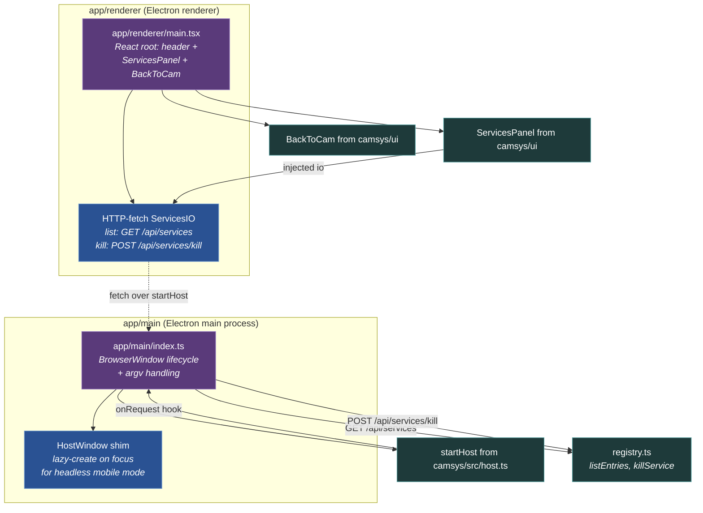
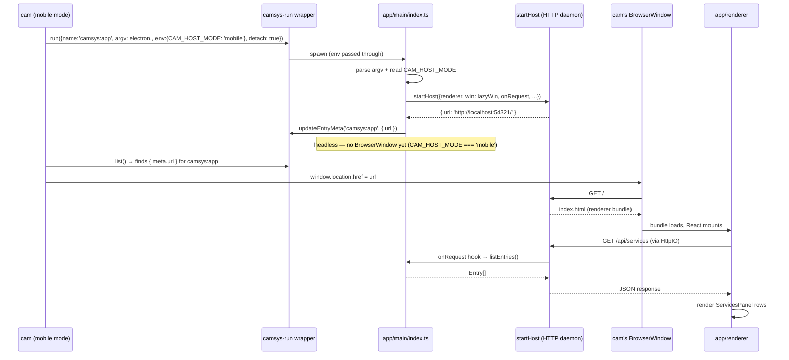

# Components — Standalone Electron app

**Scope:** internal components of the **standalone Electron app**
container from [L2](02-containers.md). The "what's running"
window — a thin Electron shell composed entirely from camsys's
own library + UI face. Demonstrates the canonical CAM-launched-app
shape (also serves as camsys's dogfood).

**Notation.** Two subgraphs for the Electron process model: main
(privileged Node + Electron APIs) and renderer (Chromium + React).
Shell entries (purple) are the process entry points. App
components (blue) are app-specific glue (the lazy-window shim, the
HTTP-fetch IO adapter). Library imports (teal) come from camsys
itself — both `src/` (host, registry) and `ui/` (ServicesPanel,
BackToCam). The dotted arrow from HttpIO back to AppMain is the
HTTP round-trip the daemon mediates.

## Components

### Main process (`app/main/index.ts`)

| Component | Responsibility |
|---|---|
| **`app/main/index.ts`** | BrowserWindow lifecycle (create + window-all-closed). Parses argv for `--port` / config flags. Calls `startHost(...)` from camsys's library. Reads `CAM_HOST_MODE` env to decide whether to materialize a window on boot or stay headless. |
| **HostWindow shim** | Implements the `HostWindow` interface that `startHost` accepts. Lazy-creates the BrowserWindow on `focus()` — handles the mobile→desktop flip after launch (cam in mobile mode keeps us headless until the user flips to desktop, at which point a `/cam-host/window-state {focus}` POST arrives and we materialize). |

The main process is **142 LOC** post-startHost-extraction (was
258 before camsys 0.2.0). The only app-specific routes the
`onRequest` hook handles are:

- `GET /api/services` → `listEntries()` from camsys's library
- `POST /api/services/kill {name}` → `killService(name)` from camsys's library

Everything else — HTTP server lifecycle, static file serve, SPA
fallback, MIME dispatch, vite dev proxy, `/cam-host/window-state` —
comes from `startHost`.

### Renderer process (`app/renderer/main.tsx`)

| Component | Responsibility |
|---|---|
| **`app/renderer/main.tsx`** | React root. Renders header + `<ServicesPanel>` + `<BackToCam>`. ~30 LOC of JSX. |
| **HTTP-fetch `ServicesIO`** | Inline implementation of camsys/ui's `ServicesIO` interface — `list()` calls `fetch('/api/services')`, `kill(name)` calls `fetch('/api/services/kill', {method:'POST'})`. The interface lives in camsys/ui; this is the standalone app's transport binding. |

## Process-boundary contract

| Edge | Transport |
|---|---|
| AppMain ↔ Renderer | HTTP via the `startHost` daemon (loopback). No preload script, no contextBridge, no `ipcMain.handle`. The renderer reaches main exclusively through the daemon's HTTP endpoints. Same shape as every other CAM-launched app (the "Phase 4b" architecture documented in cam's launched-apps.md). |
| AppMain → Registry primitives | Direct ESM import of `listEntries` / `killService` from `camsys` (since this is camsys's own repo, it imports relatively from `../../src/...`; external CAM apps would `import { ... } from 'camsys'`). |
| Renderer → ServicesPanel + BackToCam | Direct ESM import from camsys/ui (relative `../../ui/...` for dogfood; external apps `import { ... } from 'camsys/ui'`). |

## The mobile-mode flow (sequence)

Most-important sequence — what happens when cam in mobile mode
launches this app:

The launched app never materializes its own BrowserWindow in
this flow — cam's window IS the visible UI, rendering OUR
renderer bundle via OUR daemon. If the user later flips cam to
desktop mode, cam POSTs `/cam-host/window-state {focus}` → the
HostWindow shim's `focus()` materializes our window for the
first time.

## Build artifacts

| Source | Build | Output |
|---|---|---|
| `app/main/index.ts` | `electron-vite build` (main config) | `out/main/index.js` |
| `app/renderer/main.tsx` + `index.html` | `electron-vite build` (renderer config) | `out/renderer/*` |
| `app/main/index.ts` (dev) | `electron-vite dev` | served via vite, proxied through `startHost` |

The `npm run app` script launches via `node dist/src/cli.js run
camsys:app -- electron .` — so the standalone app is itself
wrapped by camsys-run (eating its own dogfood for registry
tracking).

## What this diagram does NOT show

- **The library's internal modules** (`src/spawn.ts`, etc.) —
  see [03-component-library.md](03-component-library.md).
- **The UI subpath's components** beyond the two we import —
  see [03-component-ui.md](03-component-ui.md).
- **Electron's own architecture.** main process / renderer
  process / V8 isolates / Chromium content layer are Electron's
  concerns, not camsys's. No reason to model them.
- **`startHost`'s internal request dispatch.** That's a black
  box from this app's perspective — pass `onRequest` and
  `webSocket` configs and trust the implementation. See
  [03-component-library.md#components](03-component-library.md#components)
  for the `host.ts` module's internal shape.

## Where to go next

- ↑ [`02-containers.md`](02-containers.md) — back to the container view.
- → [`03-component-library.md`](03-component-library.md) — the library modules this app composes (`startHost`, `registry` primitives).
- → [`03-component-ui.md`](03-component-ui.md) — the UI components this app renders (`ServicesPanel`, `BackToCam`).
- cam's [launched-apps.md](../../../cam/docs/architecture/launched-apps.md) — the launched-app contract this app exemplifies.
