# Components — Library module

**Scope:** internal modules of the **library module** container
from [L2](02-containers.md). This is the substance container —
the leaf primitives, the application-layer orchestrators, and
the re-export shell that forms the published `camsys` library
face. The CLI binary container is documented inline at L2 — it
has no components of its own beyond the dispatcher that calls
into these modules.

```mermaid
flowchart TB
  %% Leaf modules — touch the outside world directly, depend on nothing in camsys
  Registry[registry.ts<br/><i>~/.cam/run/ read+write<br/>+ stale-PID detection</i>]:::leaf
  Ports[ports.ts<br/><i>pickFreePort via bind&#40;0&#41;</i>]:::leaf

  %% Application-layer modules — compose leaves into use cases
  Spawn[spawn.ts<br/><i>run&#40;&#41; — process group<br/>+ port injection + cleanup</i>]:::app
  Commands[commands.ts<br/><i>list / port / kill / cleanup<br/>orchestrators for CLI</i>]:::app
  Host[host.ts<br/><i>startHost&#40;&#41; — HTTP shell<br/>for launched apps</i>]:::app
  Rebuild[rebuild.ts<br/><i>rebuild&#40;&#41; — native ABI<br/>flipper wrapping electron-rebuild</i>]:::app

  %% Presentation shells — entry points
  CLI[cli.ts<br/><i>argv parsing + dispatch<br/>&#40;CLI container entry&#41;</i>]:::shell
  Index[index.ts<br/><i>library re-export shell</i>]:::shell

  CLI --> Commands
  CLI --> Spawn
  CLI --> Rebuild
  Spawn --> Registry
  Spawn --> Ports
  Commands --> Registry
  Host --> Ports
  Index --> Registry
  Index --> Spawn
  Index --> Ports
  Index --> Host

  ExtRebuild[&#64;electron/rebuild]:::ext
  Rebuild -.->|dynamic import| ExtRebuild

  classDef leaf fill:#1e3a3a,stroke:#5eaaaa,color:#fff
  classDef app fill:#2a5293,stroke:#7aa4d4,color:#fff
  classDef shell fill:#5a3a7a,stroke:#a085c8,color:#fff
  classDef ext fill:#333,stroke:#888,color:#ddd
```



**Notation.** Three component flavors:
- **Leaf** (teal): touches the outside world (filesystem, kernel)
  + depends on no other camsys module. Independently testable.
- **Application** (blue): composes leaves into use cases. May
  depend on leaves, never on other application modules (with one
  exception noted below).
- **Shell** (purple): entry points / dispatch surfaces — CLI argv
  parser and library re-export barrel.

External deps (gray) at the edges: only one of consequence,
`@electron/rebuild`, dynamic-imported so it loads ONLY when
`camsys rebuild --target=electron` is actually invoked.

## Components

| Component | LOC | Layer | Responsibility |
|---|---|---|---|
| **`registry.ts`** | ~120 | leaf | Atomic read/write of `~/.cam/run/<name>.json`. Stale-PID detection. The ONLY module that touches the registry directory. |
| **`ports.ts`** | ~30 | leaf | `pickFreePort()` / `pickFreePorts(n)` via `bind(0)` + immediate release. The kernel guarantees uniqueness across simultaneous picks. |
| **`spawn.ts`** | ~180 | app | The `run({...})` lifecycle: sweep stale → pick ports → spawn detached + setpgid → write entry → forward signals (or unref in detach mode) → await exit → delete entry. |
| **`commands.ts`** | ~80 | app | Orchestrators for CLI verbs `list` / `port` / `kill` / `cleanup`. Pure formatting + exit-code logic over registry primitives. |
| **`host.ts`** | ~280 | app | `startHost({...})` — the HTTP shell every launched Electron app's main process uses (extracted in camsys 0.2.0). Static serve + SPA fallback + MIME + vite proxy + `/cam-host/window-state` + optional SSE + optional WebSocket upgrade. |
| **`rebuild.ts`** | ~80 | app | `rebuild({target, modules?, cwd?})` — wraps `@electron/rebuild` (electron target, dynamic import) or `npm rebuild` (node target). Single point of evolution for the native-module ABI dance across the CAM ecosystem (camsys 0.3.0). |
| **`cli.ts`** | ~120 | shell | Argv parsing + subcommand dispatch for the CLI container. Calls into `commands` / `spawn` / `rebuild`. |
| **`index.ts`** | ~50 | shell | Library re-export barrel. Defines the published library surface. |

## Edges / import rules

The arrows in the diagram are **the only allowed imports**. Stated
as inviolable invariants:

| Rule | Why |
|---|---|
| `registry.ts` imports nothing from the rest of `src/` | Leaf. Tests can stub `~/.cam/run/` via `process.env.HOME` and exercise it in pure isolation. |
| `ports.ts` imports nothing from the rest of `src/` | Leaf. Pure kernel primitive. |
| `spawn.ts` may import `registry.ts` + `ports.ts` only | Composes the two leaves into the spawn-and-track lifecycle. |
| `commands.ts` may import `registry.ts` only | CLI orchestrators are read-mostly views over the registry. |
| `host.ts` may import `ports.ts` only | `startHost` knows about ports (to bind) but **does not know about CAM's process model** (no registry import). It's a pure HTTP shell consumers compose against. |
| `rebuild.ts` imports nothing from camsys | Self-contained wrapper around `@electron/rebuild`. |
| `cli.ts` may import anything in `src/` | Dispatch shell. |
| `index.ts` may import anything in `src/` | Re-export barrel. |

Violations would create circular deps or pull the wrong things
into the wrong consumer bundles. The conformance analyzer
(audit's `architecture-conformance` rule) validates this against
`architecture.json`.

## The extraction lens — when does a module live here?

camsys grew from 5 modules to 8 across 3 minor releases:
- **0.2.0**: `host.ts` (was duplicated in 5 apps' main processes)
- **0.3.0**: `rebuild.ts` (was duplicated in 3 apps' npm scripts)
- **0.4.0**: `ui/BackToCam.tsx` (was duplicated in 4 apps' renderers — lives in the UI container, see [03-component-ui.md](03-component-ui.md))

Each extraction met both criteria:
1. **Consumer fanout ≥ 3** across the CAM ecosystem
2. **Content was mechanical or spec-bound** (not an app-specific
   design choice)

Counter-examples that explicitly stayed per-app: operation
dispatch shape (cam's WS-RPC vs audit's auto-iteration vs
docskit's hand-routes), per-app UI chrome (PackageTile, FindBar).
Different design choices per app, not mechanical.

When considering a new module here, apply the same lens. See
[CLAUDE.md](../../CLAUDE.md) for the rule.

## Spawn lifecycle (sequence — what happens over time)

```mermaid
sequenceDiagram
  participant Caller as CLI or library consumer
  participant Spawn as spawn.ts
  participant Ports as ports.ts
  participant Reg as registry.ts
  participant OS as OS (child_process)
  participant Child as Wrapped child process

  Caller->>Spawn: run({ name, argv, detach? })
  Spawn->>Reg: deleteEntry(name)  // sweep stale
  Spawn->>Ports: pickFreePorts(2)
  Ports-->>Spawn: { vitePort, cdpPort }
  Spawn->>OS: spawn(argv, {detached: true, env: {CAM_*PORT, CAM_SERVICE_NAME}})
  OS-->>Spawn: child handle (pid + pgid)
  Spawn->>Reg: writeEntry({name, pid, pgid, ports, cmd, cwd, started})
  alt detach mode
    Spawn->>OS: child.unref()
    Note over Spawn: parent event loop free<br/>to exit; awaits child<br/>asynchronously
  else CLI-foreground mode
    Spawn->>OS: forward SIGINT/SIGTERM/SIGHUP → kill(-pgid)
  end
  Child->>Child: optionally updateEntryMeta({url})
  Child-->>OS: exit
  OS-->>Spawn: exit code
  Spawn->>Reg: deleteEntry(name)
  Spawn-->>Caller: exit code
```

The `deleteEntry` runs on every exit path (clean, error, crash).
The `setpgid` (via `detached: true`) is what enables
`kill(-pgid)` to take the whole subtree down — no zombie
electron + vite + worker chains.

## What this diagram does NOT show

- **The CLI binary container** as a separate boxed system. Its
  one component (the dispatcher in `cli.ts`) is shown above
  because it imports the same library modules. The CLI is
  documented inline at [L2](02-containers.md#1-cli-binary).
- **Test fixtures.** `tests/{ports,registry,spawn,host,ui}.test.ts`
  exercise each component independently via direct import; no
  integration test runs the full CLI surface (that's the smoke
  test in consumer repos).
- **The standalone Electron app's main / renderer modules.** See
  [03-component-electron-app.md](03-component-electron-app.md).
- **The UI subpath's components.** See
  [03-component-ui.md](03-component-ui.md).
- **External API contracts.** What `startHost` actually exposes
  over HTTP (`/cam-host/window-state`, SPA fallback semantics,
  vite-proxy passthrough rules) is the launched-app contract
  documented in cam's
  [docs/architecture/launched-apps.md](../../../cam/docs/architecture/launched-apps.md).

## Where to go next

- ↑ [`02-containers.md`](02-containers.md) — back to the container view.
- → [`03-component-ui.md`](03-component-ui.md) — sibling: the UI subpath's components.
- → [`03-component-electron-app.md`](03-component-electron-app.md) — sibling: the standalone Electron app's components.
- [CLAUDE.md](../../CLAUDE.md) — the extraction lens, architectural rules.
