# Components — UI subpath

**Scope:** internal components of the **UI subpath** container
from [L2](02-containers.md) — what's published at `camsys/ui`.
Two stateless React components + a CSS file. Consumed by cam's
renderer, by the standalone Electron app's renderer, and (for
`BackToCam` only) by every CAM-launched app's renderer.

```mermaid
flowchart TB
  Index[index.ts<br/><i>re-export barrel<br/>&#40;camsys/ui&#41;</i>]:::shell
  Services[ServicesPanel.tsx<br/><i>list + kill running services</i>]:::app
  BackToCam[BackToCam.tsx<br/><i>cam-mobile referrer chip</i>]:::app
  Styles[styles.css<br/><i>panel styles<br/>consumers import separately</i>]:::asset

  Index --> Services
  Index --> BackToCam
  Index --> StylesRef[&#40;CAM_DAEMON_PORT,<br/>CAM_DAEMON_URL constants&#41;]:::asset

  React[React + react-dom<br/><i>optional peer deps</i>]:::ext
  Services -.->|JSX + hooks| React
  BackToCam -.->|JSX + hooks| React

  classDef app fill:#2a5293,stroke:#7aa4d4,color:#fff
  classDef shell fill:#5a3a7a,stroke:#a085c8,color:#fff
  classDef asset fill:#3a4a2a,stroke:#8aaa5e,color:#fff
  classDef ext fill:#333,stroke:#888,color:#ddd
```



**Notation.** Two app components (blue) backed by the index
re-export shell (purple). Styles + constants (green) are assets
consumers explicitly opt into. React is declared as an OPTIONAL
peer dep — CLI / library consumers that don't `import 'camsys/ui'`
never resolve it.

## Components

| Component | Responsibility |
|---|---|
| **`ServicesPanel.tsx`** | Renders the running-services list with a Kill button per row. Polls `io.list()` every `refreshIntervalMs` (default 2s). Takes a `ServicesIO` config (see below) so consumers control transport. |
| **`BackToCam.tsx`** | Small chip rendered by every CAM-launched app's renderer. Detects `document.referrer.port === CAM_DAEMON_PORT` and renders an `<a href={CAM_DAEMON_URL}>` link back to cam. Style is overridable for floating (default, top-right fixed) vs inline-in-header (term, camsys's own app). |
| **`index.ts`** | Re-export barrel. Public surface: `ServicesPanel`, `BackToCam`, `CAM_DAEMON_PORT`, `CAM_DAEMON_URL`, `ServicesPanelProps`, `ServicesIO`, `Entry`, `BackToCamProps`. |
| **`styles.css`** | Panel styles. Consumers opt in via `import 'camsys/ui/styles.css'` — separately exported in `package.json` so consumers without bundler CSS support can skip it. |

## The `ServicesIO` contract — why this component is portable

`ServicesPanel` does NOT decide how to reach the registry. It
delegates to an injected `ServicesIO`:

```ts
interface ServicesIO {
  list(): Promise<Entry[]>
  kill(name: string): Promise<void>
}
```

This is the single most important design choice in `ui/`: it lets
the same React component work in two transport contexts:

| Consumer | `io.list()` implementation | `io.kill()` implementation |
|---|---|---|
| **cam's renderer** (embeds ServicesPanel in System tab) | `cam.camsys.list()` over the cam api WS | `cam.camsys.focus(name)` — wait, cam **doesn't** embed ServicesPanel anymore (Tier-4 retired that — see cam roadmap "Tier 4 — cam stops observing camsys"). The IO shape was designed for that use case before extraction. |
| **camsys standalone app's renderer** | `fetch('/api/services').then(r => r.json())` | `fetch('/api/services/kill', {method:'POST', body:JSON.stringify({name})})` |

The injection lets us evolve transport independently of UI. When
the cam-embedded version returned (Tier 4 — wait, it didn't — but
the design still scales to any future renderer-in-different-host
case).

## The `BackToCam` detection rule

```ts
function loadedInsideCam(camPort: string): boolean {
  const ref = document.referrer
  if (!ref) return false
  try { return new URL(ref).port === camPort } catch { return false }
}
```

The rule: cam's BrowserWindow navigates `window.location.href` to
a launched app's daemon URL in mobile mode (see cam's
[launched-apps.md](../../../cam/docs/architecture/launched-apps.md)).
That sets `document.referrer` to cam's daemon URL. We detect by
port (default `'5200'` — cam's daemon port per ADR-010) because
host varies (localhost vs Cloudflare-tunnelled remote.cyrustek.com).

The constants `CAM_DAEMON_PORT` + `CAM_DAEMON_URL` are exported
so consumers can reference the spec value without hard-coding
`'5200'` themselves.

## Style overrides for different mount contexts

`BackToCam`'s default `position: fixed; top: 8; right: 8` works
for full-screen renderers (audit, docskit). Apps that want it
inline in their own header (term, camsys's own app) pass
`style={{ position: 'static' }}`:

```tsx
// audit's renderer — default floating
<BackToCam />

// term's renderer — inline in the header bar
<BackToCam style={{ position: 'static' }} />
```

No CSS-class system needed; the prop is sufficient.

## React as optional peer dep

`package.json` declares:

```jsonc
"peerDependencies": {
  "react": "^18.0.0 || ^19.0.0",
  "react-dom": "^18.0.0 || ^19.0.0"
}
```

…with `peerDependenciesMeta` marking both as `optional: true`.
Consumers who never `import 'camsys/ui'` don't need React
installed. The `package.json` `exports` map keeps `./ui` separate
from `.` so the CLI / library face has zero React in its
resolution tree.

## What this diagram does NOT show

- **Implementation of `ServicesPanel`'s polling.** It's a 2-line
  `setInterval` inside a `useEffect`. Not architectural.
- **The shared CSS variables.** Both components inline their
  styles in JSX (`<a style={{...}}>`) for portability — they
  render correctly even when consumers skip the CSS import.
  Only the panel benefits from the CSS file.
- **Transport-side code.** The cam-side IPC bridge or the
  standalone app's daemon routes are documented in their own
  containers — see
  [03-component-electron-app.md](03-component-electron-app.md)
  for the standalone app's HTTP endpoints.
- **The runtime `react-router` integration in cam.** Cam's
  renderer uses react-router for its own routing; that's
  documented in cam's
  [docs/architecture/03-components.md](../../../cam/docs/architecture/03-components.md).

## Where to go next

- ↑ [`02-containers.md`](02-containers.md) — back to the container view.
- → [`03-component-library.md`](03-component-library.md) — sibling: the library module's components.
- → [`03-component-electron-app.md`](03-component-electron-app.md) — sibling: the standalone Electron app, which composes both this UI subpath + the library's `startHost`.
- [CLAUDE.md](../../CLAUDE.md) — maintainer rules.
