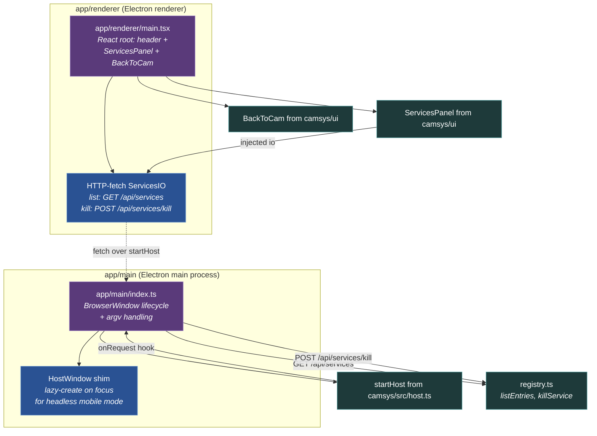
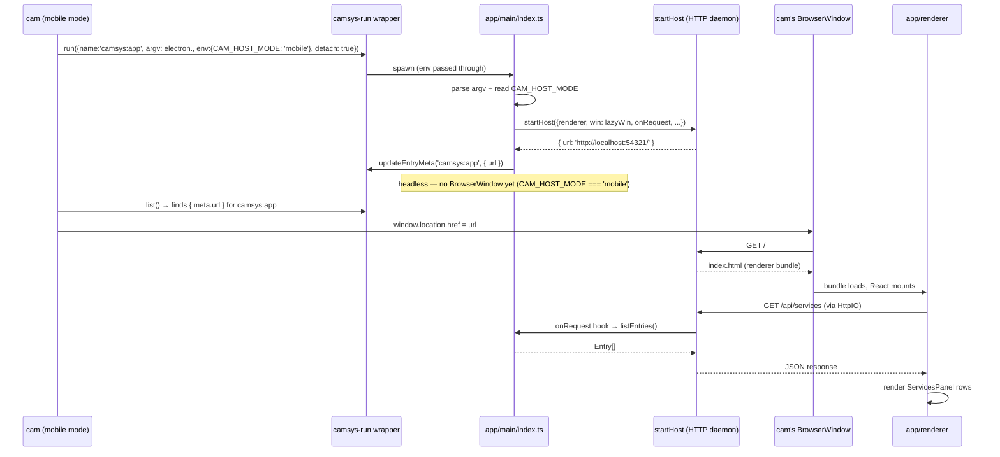

# Components (Level 3)

**Scope:** internal components of each non-trivial container from
[L2](02-containers.md). One section per container; one component
diagram per section. The CLI binary's component-level structure is
documented inline in [02-containers.md](02-containers.md#1-cli-binary)
because it's a thin dispatcher whose substance lives in the library
module — no separate section earns its keep.

Three containers get a section here:

- [Library module](#library-module) — the substance container (registry, ports, spawn, commands, host, rebuild, cli, index).
- [UI subpath](#ui-subpath) — `camsys/ui` (ServicesPanel + BackToCam + ServicesIO contract).
- [Standalone Electron app](#standalone-electron-app) — camsys's own dogfood; composes the library + UI.

---

## Library module

The substance container — leaf primitives, application-layer
orchestrators, and the re-export shell that forms the published
`camsys` library face. The CLI binary's one component (the
dispatcher in `cli.ts`) is shown below because it imports the
same library modules; it's documented at
[L2 §CLI binary](02-containers.md#1-cli-binary).

```mermaid
flowchart TB
  %% Leaf modules — touch the outside world directly, depend on nothing in camsys
  Registry[registry.ts<br/><i>~/.cam/run/ read+write<br/>+ stale-PID detection</i>]:::leaf
  Ports[ports.ts<br/><i>pickFreePort via bind&#40;0&#41;</i>]:::leaf

  %% Application-layer modules — compose leaves into use cases
  Spawn[spawn.ts<br/><i>run&#40;&#41; — process group<br/>+ port injection + cleanup</i>]:::app
  Commands[commands.ts<br/><i>list / port / kill / cleanup<br/>orchestrators for CLI</i>]:::app
  Host[host.ts<br/><i>startHost&#40;&#41; — HTTP shell<br/>for launched apps</i>]:::app
  Rebuild[rebuild.ts<br/><i>rebuild&#40;&#41; — native ABI<br/>flipper wrapping electron-rebuild</i>]:::app

  %% Presentation shells — entry points
  CLI[cli.ts<br/><i>argv parsing + dispatch<br/>&#40;CLI container entry&#41;</i>]:::shell
  Index[index.ts<br/><i>library re-export shell</i>]:::shell

  CLI --> Commands
  CLI --> Spawn
  CLI --> Rebuild
  Spawn --> Registry
  Spawn --> Ports
  Commands --> Registry
  Host --> Ports
  Index --> Registry
  Index --> Spawn
  Index --> Ports
  Index --> Host

  ExtRebuild[&#64;electron/rebuild]:::ext
  Rebuild -.->|dynamic import| ExtRebuild

  classDef leaf fill:#1e3a3a,stroke:#5eaaaa,color:#fff
  classDef app fill:#2a5293,stroke:#7aa4d4,color:#fff
  classDef shell fill:#5a3a7a,stroke:#a085c8,color:#fff
  classDef ext fill:#333,stroke:#888,color:#ddd
```



**Notation.** Three component flavors:
- **Leaf** (teal): touches the outside world (filesystem, kernel)
  + depends on no other camsys module. Independently testable.
- **Application** (blue): composes leaves into use cases. May
  depend on leaves, never on other application modules (with one
  exception noted below).
- **Shell** (purple): entry points / dispatch surfaces — CLI argv
  parser and library re-export barrel.

External deps (gray) at the edges: only one of consequence,
`@electron/rebuild`, dynamic-imported so it loads ONLY when
`camsys rebuild --target=electron` is actually invoked.

### Modules

| Component | LOC | Layer | Responsibility |
|---|---|---|---|
| **`registry.ts`** | ~120 | leaf | Atomic read/write of `~/.cam/run/<name>.json`. Stale-PID detection. The ONLY module that touches the registry directory. |
| **`ports.ts`** | ~30 | leaf | `pickFreePort()` / `pickFreePorts(n)` via `bind(0)` + immediate release. The kernel guarantees uniqueness across simultaneous picks. |
| **`spawn.ts`** | ~180 | app | The `run({...})` lifecycle: sweep stale → pick ports → spawn detached + setpgid → write entry → forward signals (or unref in detach mode) → await exit → delete entry. |
| **`commands.ts`** | ~80 | app | Orchestrators for CLI verbs `list` / `port` / `kill` / `cleanup`. Pure formatting + exit-code logic over registry primitives. |
| **`host.ts`** | ~280 | app | `startHost({...})` — the HTTP shell every launched Electron app's main process uses (extracted in camsys 0.2.0). Static serve + SPA fallback + MIME + vite proxy + `/cam-host/window-state` + optional SSE + optional WebSocket upgrade. |
| **`rebuild.ts`** | ~80 | app | `rebuild({target, modules?, cwd?})` — wraps `@electron/rebuild` (electron target, dynamic import) or `npm rebuild` (node target). Single point of evolution for the native-module ABI dance across the CAM ecosystem (camsys 0.3.0). |
| **`cli.ts`** | ~120 | shell | Argv parsing + subcommand dispatch for the CLI container. Calls into `commands` / `spawn` / `rebuild`. |
| **`index.ts`** | ~50 | shell | Library re-export barrel. Defines the published library surface. |

### Edges / import rules

The arrows in the diagram are **the only allowed imports**. Stated
as inviolable invariants:

| Rule | Why |
|---|---|
| `registry.ts` imports nothing from the rest of `src/` | Leaf. Tests can stub `~/.cam/run/` via `process.env.HOME` and exercise it in pure isolation. |
| `ports.ts` imports nothing from the rest of `src/` | Leaf. Pure kernel primitive. |
| `spawn.ts` may import `registry.ts` + `ports.ts` only | Composes the two leaves into the spawn-and-track lifecycle. |
| `commands.ts` may import `registry.ts` only | CLI orchestrators are read-mostly views over the registry. |
| `host.ts` may import `ports.ts` only | `startHost` knows about ports (to bind) but **does not know about CAM's process model** (no registry import). It's a pure HTTP shell consumers compose against. |
| `rebuild.ts` imports nothing from camsys | Self-contained wrapper around `@electron/rebuild`. |
| `cli.ts` may import anything in `src/` | Dispatch shell. |
| `index.ts` may import anything in `src/` | Re-export barrel. |

Violations would create circular deps or pull the wrong things
into the wrong consumer bundles. The conformance analyzer
(audit's `architecture-conformance` rule) validates this against
`architecture.json`.

### The extraction lens — when does a module live here?

camsys grew from 5 modules to 8 across 3 minor releases:
- **0.2.0**: `host.ts` (was duplicated in 5 apps' main processes)
- **0.3.0**: `rebuild.ts` (was duplicated in 3 apps' npm scripts)
- **0.4.0**: `ui/BackToCam.tsx` (was duplicated in 4 apps' renderers — lives in the UI container, see [UI subpath](#ui-subpath))

Each extraction met both criteria:
1. **Consumer fanout ≥ 3** across the CAM ecosystem
2. **Content was mechanical or spec-bound** (not an app-specific
   design choice)

Counter-examples that explicitly stayed per-app: operation
dispatch shape (cam's WS-RPC vs audit's auto-iteration vs
docskit's hand-routes), per-app UI chrome (PackageTile, FindBar).
Different design choices per app, not mechanical.

When considering a new module here, apply the same lens. See
[CLAUDE.md](../../CLAUDE.md) for the rule.

### Spawn lifecycle (sequence — what happens over time)

```mermaid
sequenceDiagram
  participant Caller as CLI or library consumer
  participant Spawn as spawn.ts
  participant Ports as ports.ts
  participant Reg as registry.ts
  participant OS as OS (child_process)
  participant Child as Wrapped child process

  Caller->>Spawn: run({ name, argv, detach? })
  Spawn->>Reg: deleteEntry(name)  // sweep stale
  Spawn->>Ports: pickFreePorts(2)
  Ports-->>Spawn: { vitePort, cdpPort }
  Spawn->>OS: spawn(argv, {detached: true, env: {CAM_*PORT, CAM_SERVICE_NAME}})
  OS-->>Spawn: child handle (pid + pgid)
  Spawn->>Reg: writeEntry({name, pid, pgid, ports, cmd, cwd, started})
  alt detach mode
    Spawn->>OS: child.unref()
    Note over Spawn: parent event loop free<br/>to exit; awaits child<br/>asynchronously
  else CLI-foreground mode
    Spawn->>OS: forward SIGINT/SIGTERM/SIGHUP → kill(-pgid)
  end
  Child->>Child: optionally updateEntryMeta({url})
  Child-->>OS: exit
  OS-->>Spawn: exit code
  Spawn->>Reg: deleteEntry(name)
  Spawn-->>Caller: exit code
```

The `deleteEntry` runs on every exit path (clean, error, crash).
The `setpgid` (via `detached: true`) is what enables
`kill(-pgid)` to take the whole subtree down — no zombie
electron + vite + worker chains.

### What this section does NOT show

- **The CLI binary container** as a separate boxed system. Its
  one component (the dispatcher in `cli.ts`) is shown above
  because it imports the same library modules. The CLI is
  documented inline at [L2](02-containers.md#1-cli-binary).
- **Test fixtures.** `tests/{ports,registry,spawn,host,ui}.test.ts`
  exercise each component independently via direct import; no
  integration test runs the full CLI surface (that's the smoke
  test in consumer repos).
- **The standalone Electron app's main / renderer modules.** See
  [Standalone Electron app](#standalone-electron-app).
- **The UI subpath's components.** See [UI subpath](#ui-subpath).
- **External API contracts.** What `startHost` actually exposes
  over HTTP (`/cam-host/window-state`, SPA fallback semantics,
  vite-proxy passthrough rules) is the launched-app contract
  documented in cam's
  [`docs/launched-apps.md`](../launched-apps.md).

---

## UI subpath

What's published at `camsys/ui` — two stateless React components +
a CSS file. Consumed by cam's renderer, by the standalone
Electron app's renderer, and (for `BackToCam` only) by every
CAM-launched app's renderer.

```mermaid
flowchart TB
  Index[index.ts<br/><i>re-export barrel<br/>&#40;camsys/ui&#41;</i>]:::shell
  Services[ServicesPanel.tsx<br/><i>list + kill running services</i>]:::app
  BackToCam[BackToCam.tsx<br/><i>cam-mobile referrer chip</i>]:::app
  Styles[styles.css<br/><i>panel styles<br/>consumers import separately</i>]:::asset

  Index --> Services
  Index --> BackToCam
  Index --> StylesRef[&#40;CAM_DAEMON_PORT,<br/>CAM_DAEMON_URL constants&#41;]:::asset

  React[React + react-dom<br/><i>optional peer deps</i>]:::ext
  Services -.->|JSX + hooks| React
  BackToCam -.->|JSX + hooks| React

  classDef app fill:#2a5293,stroke:#7aa4d4,color:#fff
  classDef shell fill:#5a3a7a,stroke:#a085c8,color:#fff
  classDef asset fill:#3a4a2a,stroke:#8aaa5e,color:#fff
  classDef ext fill:#333,stroke:#888,color:#ddd
```



**Notation.** Two app components (blue) backed by the index
re-export shell (purple). Styles + constants (green) are assets
consumers explicitly opt into. React is declared as an OPTIONAL
peer dep — CLI / library consumers that don't `import 'camsys/ui'`
never resolve it.

### Components

| Component | Responsibility |
|---|---|
| **`ServicesPanel.tsx`** | Renders the running-services list with a Kill button per row. Polls `io.list()` every `refreshIntervalMs` (default 2s). Takes a `ServicesIO` config (see below) so consumers control transport. |
| **`BackToCam.tsx`** | Small chip rendered by every CAM-launched app's renderer. Detects `document.referrer.port === CAM_DAEMON_PORT` and renders an `<a href={CAM_DAEMON_URL}>` link back to cam. Style is overridable for floating (default, top-right fixed) vs inline-in-header (term, camsys's own app). |
| **`index.ts`** | Re-export barrel. Public surface: `ServicesPanel`, `BackToCam`, `CAM_DAEMON_PORT`, `CAM_DAEMON_URL`, `ServicesPanelProps`, `ServicesIO`, `Entry`, `BackToCamProps`. |
| **`styles.css`** | Panel styles. Consumers opt in via `import 'camsys/ui/styles.css'` — separately exported in `package.json` so consumers without bundler CSS support can skip it. |

### The `ServicesIO` contract — why this component is portable

`ServicesPanel` does NOT decide how to reach the registry. It
delegates to an injected `ServicesIO`:

```ts
interface ServicesIO {
  list(): Promise<Entry[]>
  kill(name: string): Promise<void>
}
```

This is the single most important design choice in `ui/`: it lets
the same React component work in two transport contexts:

| Consumer | `io.list()` implementation | `io.kill()` implementation |
|---|---|---|
| **cam's renderer** (embeds ServicesPanel in System tab) | `cam.camsys.list()` over the cam api WS | `cam.camsys.focus(name)` — wait, cam **doesn't** embed ServicesPanel anymore (Tier-4 retired that — see cam roadmap "Tier 4 — cam stops observing camsys"). The IO shape was designed for that use case before extraction. |
| **camsys standalone app's renderer** | `fetch('/api/services').then(r => r.json())` | `fetch('/api/services/kill', {method:'POST', body:JSON.stringify({name})})` |

The injection lets us evolve transport independently of UI. When
the cam-embedded version returned (Tier 4 — wait, it didn't — but
the design still scales to any future renderer-in-different-host
case).

### The `BackToCam` detection rule

```ts
function loadedInsideCam(camPort: string): boolean {
  const ref = document.referrer
  if (!ref) return false
  try { return new URL(ref).port === camPort } catch { return false }
}
```

The rule: cam's BrowserWindow navigates `window.location.href` to
a launched app's daemon URL in mobile mode (see cam's
[`docs/launched-apps.md`](../launched-apps.md)).
That sets `document.referrer` to cam's daemon URL. We detect by
port (default `'5200'` — cam's daemon port per ADR-010) because
host varies (localhost vs Cloudflare-tunnelled remote.cyrustek.com).

The constants `CAM_DAEMON_PORT` + `CAM_DAEMON_URL` are exported
so consumers can reference the spec value without hard-coding
`'5200'` themselves.

### Style overrides for different mount contexts

`BackToCam`'s default `position: fixed; top: 8; right: 8` works
for full-screen renderers (audit, docskit). Apps that want it
inline in their own header (term, camsys's own app) pass
`style={{ position: 'static' }}`:

```tsx
// audit's renderer — default floating
<BackToCam />

// term's renderer — inline in the header bar
<BackToCam style={{ position: 'static' }} />
```

No CSS-class system needed; the prop is sufficient.

### React as optional peer dep

`package.json` declares:

```jsonc
"peerDependencies": {
  "react": "^18.0.0 || ^19.0.0",
  "react-dom": "^18.0.0 || ^19.0.0"
}
```

…with `peerDependenciesMeta` marking both as `optional: true`.
Consumers who never `import 'camsys/ui'` don't need React
installed. The `package.json` `exports` map keeps `./ui` separate
from `.` so the CLI / library face has zero React in its
resolution tree.

### What this section does NOT show

- **Implementation of `ServicesPanel`'s polling.** It's a 2-line
  `setInterval` inside a `useEffect`. Not architectural.
- **The shared CSS variables.** Both components inline their
  styles in JSX (`<a style={{...}}>`) for portability — they
  render correctly even when consumers skip the CSS import.
  Only the panel benefits from the CSS file.
- **Transport-side code.** The cam-side IPC bridge or the
  standalone app's daemon routes are documented in their own
  containers — see
  [Standalone Electron app](#standalone-electron-app)
  for the standalone app's HTTP endpoints.
- **The runtime `react-router` integration in cam.** Cam's
  renderer uses react-router for its own routing; that's
  documented in cam's
  [docs/architecture/03-components.md](../../../cam/docs/architecture/03-components.md).

---

## Standalone Electron app

The "what's running" window — a thin Electron shell composed
entirely from camsys's own library + UI face. Demonstrates the
canonical CAM-launched-app shape (also serves as camsys's
dogfood).



**Notation.** Two subgraphs for the Electron process model: main
(privileged Node + Electron APIs) and renderer (Chromium + React).
Shell entries (purple) are the process entry points. App
components (blue) are app-specific glue (the lazy-window shim, the
HTTP-fetch IO adapter). Library imports (teal) come from camsys
itself — both `src/` (host, registry) and `ui/` (ServicesPanel,
BackToCam). The dotted arrow from HttpIO back to AppMain is the
HTTP round-trip the daemon mediates.

### Main process (`app/main/index.ts`)

| Component | Responsibility |
|---|---|
| **`app/main/index.ts`** | BrowserWindow lifecycle (create + window-all-closed). Parses argv for `--port` / config flags. Calls `startHost(...)` from camsys's library. Reads `CAM_HOST_MODE` env to decide whether to materialize a window on boot or stay headless. |
| **HostWindow shim** | Implements the `HostWindow` interface that `startHost` accepts. Lazy-creates the BrowserWindow on `focus()` — handles the mobile→desktop flip after launch (cam in mobile mode keeps us headless until the user flips to desktop, at which point a `/cam-host/window-state {focus}` POST arrives and we materialize). |

The main process is **142 LOC** post-startHost-extraction (was
258 before camsys 0.2.0). The only app-specific routes the
`onRequest` hook handles are:

- `GET /api/services` → `listEntries()` from camsys's library
- `POST /api/services/kill {name}` → `killService(name)` from camsys's library

Everything else — HTTP server lifecycle, static file serve, SPA
fallback, MIME dispatch, vite dev proxy, `/cam-host/window-state` —
comes from `startHost`.

### Renderer process (`app/renderer/main.tsx`)

| Component | Responsibility |
|---|---|
| **`app/renderer/main.tsx`** | React root. Renders header + `<ServicesPanel>` + `<BackToCam>`. ~30 LOC of JSX. |
| **HTTP-fetch `ServicesIO`** | Inline implementation of camsys/ui's `ServicesIO` interface — `list()` calls `fetch('/api/services')`, `kill(name)` calls `fetch('/api/services/kill', {method:'POST'})`. The interface lives in camsys/ui; this is the standalone app's transport binding. |

### Process-boundary contract

| Edge | Transport |
|---|---|
| AppMain ↔ Renderer | HTTP via the `startHost` daemon (loopback). No preload script, no contextBridge, no `ipcMain.handle`. The renderer reaches main exclusively through the daemon's HTTP endpoints. Same shape as every other CAM-launched app — the [launched-app contract](../launched-apps.md) is the spec. |
| AppMain → Registry primitives | Direct ESM import of `listEntries` / `killService` from `camsys` (since this is camsys's own repo, it imports relatively from `../../src/...`; external CAM apps would `import { ... } from 'camsys'`). |
| Renderer → ServicesPanel + BackToCam | Direct ESM import from camsys/ui (relative `../../ui/...` for dogfood; external apps `import { ... } from 'camsys/ui'`). |

### The mobile-mode flow (sequence)

Most-important sequence — what happens when cam in mobile mode
launches this app:



The launched app never materializes its own BrowserWindow in
this flow — cam's window IS the visible UI, rendering OUR
renderer bundle via OUR daemon. If the user later flips cam to
desktop mode, cam POSTs `/cam-host/window-state {focus}` → the
HostWindow shim's `focus()` materializes our window for the
first time.

### Build artifacts

| Source | Build | Output |
|---|---|---|
| `app/main/index.ts` | `electron-vite build` (main config) | `out/main/index.js` |
| `app/renderer/main.tsx` + `index.html` | `electron-vite build` (renderer config) | `out/renderer/*` |
| `app/main/index.ts` (dev) | `electron-vite dev` | served via vite, proxied through `startHost` |

The `npm run app` script launches via `node dist/src/cli.js run
camsys:app -- electron .` — so the standalone app is itself
wrapped by camsys-run (eating its own dogfood for registry
tracking).

### What this section does NOT show

- **The library's internal modules** (`src/spawn.ts`, etc.) —
  see [Library module](#library-module).
- **The UI subpath's components** beyond the two we import —
  see [UI subpath](#ui-subpath).
- **Electron's own architecture.** main process / renderer
  process / V8 isolates / Chromium content layer are Electron's
  concerns, not camsys's. No reason to model them.
- **`startHost`'s internal request dispatch.** That's a black
  box from this app's perspective — pass `onRequest` and
  `webSocket` configs and trust the implementation. See
  [Library module § Modules](#modules) for the `host.ts`
  module's internal shape.

---

## Where to go next

- ↑ [`02-containers.md`](02-containers.md) — back to the container view.
- ↑ [`01-context.md`](01-context.md) — camsys among external actors.
- [CLAUDE.md](../../CLAUDE.md) — maintainer rules + the extraction lens.
- [`docs/launched-apps.md`](../launched-apps.md) — the launched-app contract `startHost` implements + that the standalone app exemplifies.
