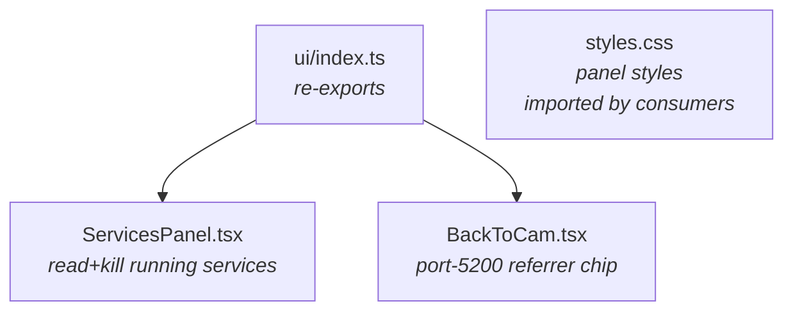

# Components (Level 3)

Module-level view. Each `src/*.ts` and `ui/*.tsx` has a focused
responsibility; cross-module dependencies are deliberately narrow.

## `src/` — Node + CLI

```mermaid
flowchart TD
    CLI[cli.ts<br/><i>argv parsing + dispatch</i>]
    Commands[commands.ts<br/><i>list / port / kill / cleanup<br/>implementations</i>]
    Spawn[spawn.ts<br/><i>run&#40;&#41; — process group<br/>+ port injection + cleanup</i>]
    Host[host.ts<br/><i>startHost&#40;&#41; — HTTP shell<br/>for launched apps</i>]
    Rebuild[rebuild.ts<br/><i>rebuild&#40;&#41; — native ABI<br/>flipper wrapping electron-rebuild</i>]
    Registry[registry.ts<br/><i>~/.cam/run/ read+write<br/>+ stale-PID detection</i>]
    Ports[ports.ts<br/><i>pickFreePort&#40;&#41; via bind&#40;0&#41;</i>]
    Index[index.ts<br/><i>library face — re-exports</i>]

    CLI --> Commands
    CLI --> Spawn
    CLI --> Rebuild
    Spawn --> Registry
    Spawn --> Ports
    Commands --> Registry
    Host --> Ports
    Index --> Registry
    Index --> Spawn
    Index --> Ports
    Index --> Host
```



### Module-by-module

**`cli.ts` (105 LOC)** — One `main()` that switches on the first
argv argument. Each subcommand parses its own remaining args. The
shebang at top makes it executable as `camsys` after npm install
(via the `"bin"` field in package.json).

**`commands.ts`** — `cmdList`, `cmdPort`, `cmdKill`, `cmdCleanup`.
Pure orchestration over `registry.ts` primitives — formats output
for the terminal, picks exit codes. No state, no I/O beyond what
registry.ts already does.

**`spawn.ts`** — The lifecycle owner for camsys-wrapped children.
One `run({name, argv, cwd?, env?, detach?})` async function:
1. Sweep any stale entry with the same name
2. Pick two free ports (vitePort, cdpPort)
3. Spawn the child via `child_process.spawn` with `detached: true` so
   the child gets its own process group (POSIX `setpgid`)
4. Write the registry entry with PID + PGID + ports + cmd + cwd
5. In `detach: true` mode → `child.unref()` (parent's event loop
   can exit while child keeps running). Otherwise → forward
   SIGINT/SIGTERM/SIGHUP to `kill(-pgid)` so the entire process
   group dies together
6. Await child exit, capture exit code, **always** delete the
   registry entry on exit (clean + error paths both)

**`registry.ts`** — The only module that touches `~/.cam/run/`.
Exports: `Entry` type, `registryDir()` (lazy so HOME-override tests
work), `listEntries`, `readEntry`, `deleteEntry`, `isPidAlive`,
`sweepStale`, `killService` (SIGTERM the pgid + delete the entry),
`updateEntryMeta` (merge into the optional meta field for children
that want to advertise extra data like daemon URL),
`focusService`/`minimizeService` (POST to the entry's
`meta.url + /cam-host/window-state`).

Atomic-write via `writeFileSync(tmp) + renameSync(tmp, target)` so
concurrent readers never see partial JSON. Reads are
defensive — anything that fails to parse is skipped, not surfaced
as an error. Stale-PID entries (PID exists in file, but the process
is gone) are filtered out by every read path.

**`ports.ts`** — `pickFreePort()` asks the kernel for an ephemeral
port via `bind(0)`, reads back the assigned port, releases the
socket. `pickFreePorts(n)` batches. Race window between release and
caller-bind is tiny enough that we've never seen a collision in
practice; the same primitive vitest + Playwright use.

**`host.ts` (added in 0.2.0)** — `startHost({...})` is the
canonical HTTP shell every CAM-launched Electron app's main process
calls instead of hand-rolling its own server. Implements the
launched-app contract documented in cam's
`docs/architecture/launched-apps.md`:

- HTTP server (kernel-picked free port unless `port:` overridden)
- Static file serve with SPA fallback + MIME dispatch
- Vite dev proxy when `renderer.viteDevUrl` is set
- `POST /cam-host/window-state {action: focus|minimize}` — handles
  if `win:` provided (HostWindow interface)
- Optional `GET /api/events` SSE channel (when `sse: true`) +
  `pushSse(event, payload)` helper on the returned handle
- Optional WebSocket upgrade on a caller-chosen path
- `onRequest(req, res, url)` hook for app-specific routes — runs
  BEFORE static/proxy fallback; return true to consume, false to
  fall through

Returns `{ url, pushSse, close }`. The handle's `close()` properly
tears down SSE clients + WebSocket connections + the HTTP server.

Replaced ~500 LOC of hand-rolled scaffolding across 5 apps (cam,
audit, docskit, term, camsys's own app) with one shared implementation.

**`rebuild.ts` (added in 0.3.0)** — `rebuild({target, modules?,
cwd?})` is the only place `@electron/rebuild` is imported in the
CAM ecosystem.

- `target: 'electron'` → dynamic-imports `@electron/rebuild`,
  resolves Electron's installed version from `<cwd>/node_modules/
  electron/package.json`, runs the rebuild (downloads prebuilts for
  Electron's ABI — ~3s, not ~30s compile)
- `target: 'node'` → spawns `npm rebuild` against the invoking
  Node (whatever vitest will run on)
- `modules` positional restricts to specific packages (matches
  `electron-rebuild -w` semantics); omitted = all native modules

Consumers (cam, audit, term) wire 3 npm scripts:
```
"postinstall": "camsys rebuild --target=electron <module>",
"predev":      "camsys rebuild --target=electron <module>",
"pretest":     "camsys rebuild --target=node     <module>"  // only when tests load the binary
```

When N-API maturity or `node:sqlite` ships in Electron and the
dance becomes unnecessary, **one swap in this file** propagates to
every consumer.

**`index.ts`** — Library face. Re-exports the public surface only.
Internal helpers in `registry.ts` (`isPidAlive`, `entryPath`)
aren't re-exported here.

## `ui/` — React subpath



**`ServicesPanel.tsx`** — Renders the running-services list with a
Kill button per row. Takes a `ServicesIO` config:
```ts
interface ServicesIO {
  list(): Promise<Entry[]>
  kill(name: string): Promise<void>
}
```
…so consumers control transport. cam injects an IPC-backed io
(cam's main process exposes `camsys:list` / `camsys:kill` channels);
the standalone app injects HTTP `fetch('/api/services')`.

Polls every `refreshIntervalMs` (default 2s) for fresh data.

**`BackToCam.tsx` (added in 0.4.0)** — Small chip rendered by every
launched app's renderer. Detects `document.referrer.port` matches
cam's daemon (CAM_DAEMON_PORT, default `'5200'` per cam's ADR-010)
and renders an `<a href="http://localhost:5200/">` link back.
Style is overridable via prop:
- Default: `position: fixed; top: 8; right: 8` — floating chip (audit, docskit)
- Override `style={{ position: 'static' }}` for inline-in-header (term, camsys-app)

Also exports `CAM_DAEMON_PORT` + `CAM_DAEMON_URL` constants so
consumers can reference the same source of truth.

## `app/` — standalone Electron app

```mermaid
flowchart TD
    AppMain[app/main/index.ts<br/><i>BrowserWindow + startHost&#40;&#41;<br/>+ /api/services + /api/services/kill</i>]
    AppRend[app/renderer/main.tsx<br/><i>React root: header + ServicesPanel + BackToCam</i>]

    AppMain --> Host
    AppMain --> Registry
    AppRend --> Services
    AppRend --> BackToCamCmp[BackToCam]

    classDef camsys fill:#1f3b5c,stroke:#7aa4d4,color:#fff
    class Host,Registry,Services,BackToCamCmp camsys
```



Main process is **142 LOC** post-startHost-extraction (was 258).
The only app-specific routes are `/api/services` (returns
`listEntries()`) and `/api/services/kill` (calls `killService`).
Everything else — HTTP server, static serve, vite proxy,
`/cam-host/window-state`, MIME — comes from `startHost`.

The renderer is a thin React shell. Same `ServicesPanel` cam
embeds, just with HTTP-fetch io instead of cam's IPC io.

## Cross-module dependency rules

The arrows in the diagrams above are the ALLOWED imports. Anything
not shown is forbidden:

- **`registry.ts` imports nothing** from the rest of `src/`. It's a
  leaf. Tests can stub `~/.cam/run/` via `process.env.HOME` and
  exercise it in isolation.
- **`spawn.ts` may import `registry.ts` + `ports.ts`** (it writes
  entries with allocated ports). Not the other way around.
- **`host.ts` may import `ports.ts`** (port allocation). Not
  `spawn.ts` or `registry.ts` — `startHost` is a pure HTTP shell;
  it knows nothing about CAM's process model.
- **`rebuild.ts` imports nothing** from camsys. It's a self-contained
  wrapper around `@electron/rebuild`.
- **`cli.ts` and `index.ts` may import anything in `src/`** — they're
  the dispatch + re-export shells.
- **`ui/*` imports nothing from `src/`** — UI components are
  transport-agnostic; consumers inject their own io shapes.

Violations would create circular deps or pull the wrong things into
the wrong consumer bundles.

## Why each face exists (the extraction lens)

The four faces aren't accidental. Each was added when the extraction
criteria were met:

| Face | When extracted | Consumer fanout | Why centralized |
|---|---|---|---|
| **CLI** | 0.1.0 (initial) | every npm script in every CAM repo | spawn-and-track is one canonical lifecycle; each repo doing it differently = drift |
| **Library `run()`** | 0.1.0 | cam (main) | programmatic access to same lifecycle without shelling out |
| **`pickFreePort`** | 0.1.0 | every dev-server config in every repo | every repo would otherwise hardcode different ports + collide |
| **Registry primitives** | 0.1.0 | every consumer | one source of truth for "what's running"; no consumer should parse `~/.cam/run/` themselves |
| **`ServicesPanel`** (`ui/`) | 0.1.0 | cam (renderer), standalone app | one UI for "what's running"; standalone + embedded both render it |
| **`startHost`** (`host.ts`) | 0.2.0 | 5 apps | `/cam-host/window-state` is a spec; ~100 LOC of identical boilerplate per app |
| **`rebuild`** | 0.3.0 | 3 apps | `@electron/rebuild` is mechanical infrastructure; consumers each had divergent dance scripts |
| **`BackToCam`** (`ui/`) | 0.4.0 | 4 apps | the port-5200 detection rule is a spec; ~40 LOC of identical chip per app |

The lens (also recorded in `CLAUDE.md`): **fanout = N AND content =
mechanical/spec-bound → extract; otherwise keep in-repo.** Counter-
examples that stay per-app: operation dispatch shape (cam's WS-RPC vs
audit's auto-iteration vs docskit's hand-routes), per-app UI chrome
(PackageTile, FindBar, etc.) — different design choices per app,
not mechanical.

## Related

- [`01-context.md`](01-context.md) — L1: camsys among external actors
- [`02-containers.md`](02-containers.md) — L2: the four containers + their consumer mapping
- [README.md](../../README.md) — consumer usage
- [CLAUDE.md](../../CLAUDE.md) — maintainer rules
- cam's `docs/architecture/launched-apps.md` — the launched-app contract `startHost` implements
- cam's `docs/roadmap.md` — roadmap entries for each extraction: "Camsys 0.2.0 — startHost extraction", "Native module rebuilds via camsys rebuild", "Post-arc cleanup sweep" (BackToCam)
